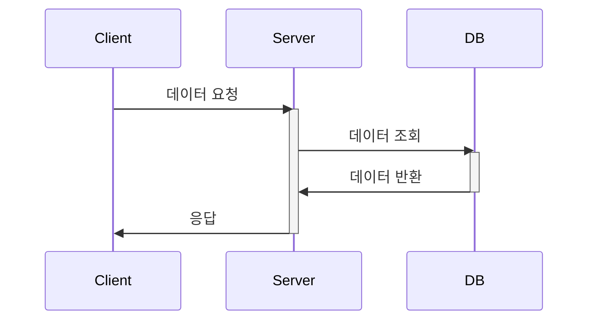
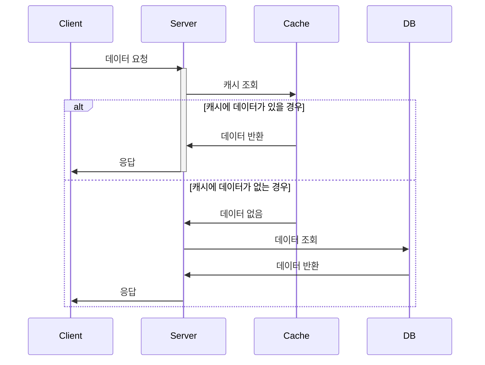

## 개요

### 캐시의 정의

캐시는 값을 미리 복사해 놓는 임시 저장소를 말한다.
캐시는 캐시의 접근 시간에 비해 `원래 데이터가 저장된 장소에 접근하는 시간이
오래 걸리는 경우`나 `값을 다시 계산하는 시간을 절약하고 싶은 경우`에 사용한다.

위 설명을 듣고, CDN과 같은 개념을 떠올렸다면 사실 캐시에 대해 거의 이해했다고 볼 수도 있다. 다만 앞으로 설명을 위해 예시를 드는 것은 웹 어플리케이션 서버가 요청을 어떻게 처리하는지에 초점을 둘 것이다.

캐시가 어떤 역할을 하는지 다이어그램으로 정리하면 다음과 같다. 만약 캐시가 없다면 클라이언트와 일반적인 웹 서버의 통신은 밑에 그림처럼 이루어질 것이다.

만약 중간에 캐시가 있다면 다음과 같은 구조로 변한다.

캐싱 전략에 따라 정확한 흐름은 세분화될 수 있지만 일단 기본적인 흐름은 위 그림과 같다.

### 캐시 효용성

캐시는 메모리를 저장소로 사용하고 데이터베이스는 HDD를 저장소로 사용한다고 가정해보면 다음과 같은 사실을 유추할 수 있다.

- 캐시가 더 비쌀 것이다. 왜냐면 보통 메모리가 하드디스크보다 용량 당 가격이 비싸니까
- 캐시가 더 빠를 것이다. 왜냐면 메모리의 전송속도가 더 빠르니까

캐시는 더 빠르지만, 더 비싸다. 그래서 비용절약을 위해 DB와 캐시는 혼용해서 사용된다. 그럼 필연적으로 캐시에 저장할 수 있는 용량은 데이터베이스의 모든 데이터를 적재하기엔 모자른 경우가 대부분이다. 그렇기 때문에 캐시에 데이터를 적재하거나 삭제하는 방법을 여러 상황에 따라 적절하게 골라야 한다. 다만 해당 포스트는 레디스에 대한 포스트로 간단하게 캐시의 정의를 짚고 넘어가는 차원에서 작성을 하기로 했으니, 캐시 전략에 대해선 자세히 서술하지 않을 것이다. 종합해보면 결국 캐시에 요청하는 데이터가 실제로 캐시에 존재하여 데이터베이스까지 접근하는 경우를 최대한 줄여야 캐시의 효용성이 높다고 할 수 있을 것이다.

## 레디스 정의

레디스는 원격 데이터 저장소로 분산 캐시, 키-값 데이터베이스, 캐시, 메시지 브로커의 역할을 한다. 레디스라는 이름 자체도 원격 딕셔너리 서버(Remote Dictionary Server)의 줄임말이다. 레디스는 모든 데이터를 메모리에 저장하기 때문에, 입/출력 대기시간이 파일입출력 기반의 데이터베이스에 비해 훨씬 빠르다.

### 레디스의 역사

레디스 개발자들은 레디스를 본인들의 문제를 해결하기 위해 개발했는데, 본인들의 사업 아이템인 실시간 웹 로그 분석기를 개발하면서 기존의 데이터베이스들을 사용해보니 심각한 성능 문제를 겪게 되었고, 이를 해결하기 위해 메모리를 저장소로 사용하는 원격 데이터 저장소를 생각한 것이었다. 레디스를 개발하고난 후, 사내 프로젝트에서 성공적으로 사용한 뒤, 레디스는 오픈소스로 공개됐다. 오픈소스로 공개되고 난 뒤, 깃허브와 인스타그램이 레디스를 채택한 첫 회사들이었다.

### 차별점

레디스가 이렇게 나오자마자 여러 회사에 채택되고 쓰이고 있는 이유론, 데이터 저장소와 캐시를 동시에 고려할 수 있기 때문이었다. 레디스는 데이터를 항상 메모리에서 수정하고, 읽히도록 했지만 디스크에서 데이터를 영구적으로 저장하여 제한적으로 데이터의 지속성을 확보할 수 있다.

또한 기존의 데이터베이스인 관계형 디비와 다른 데이터 접근방식을 제공한다. RDB는 쿼리를 입력받고 엔진에서 해당 쿼리를 실행했다면, 레디스는 추상 데이터 타입에 의해 데이터에 대한 작업을 수행할 수 있다. 이런 추상 데이터 타입은 흔하게 접하는 문자열, JSON, List, Set 등 많은 종류가 있다. 그렇기 때문에 레디스에서 데이터에 대한 접근을 효율적으로 처리하려면 데이터에 맞는 데이터 타입을 채택해야 한다.

## 레디스 활용처

레디스는 유저의 세션을 저장하는 저장소, 페이지 캐시 저장소, 메시지 큐, 실시간 랭킹, 발생/구독 기능 들을 구현하는데 많이 사용된다.

### 레디스 최신동향

현재 최신 버전은 7이며, 2022년에 배포되었다.

해당버전에서 추가된 추가 기능은 Lua 스크립트를 레디스에 전송하여 실행가능하게 한 레디스 함수 기능

보안을 위해 Redis 6 버전에서 추가된 ACL을 발전시킨 ACL2

전체적인 성능 향상을 이뤄냈다고 한다.

## 참고

- https://redis.com/blog/redis-7-generally-available/
- https://en.wikipedia.org/wiki/Redis
